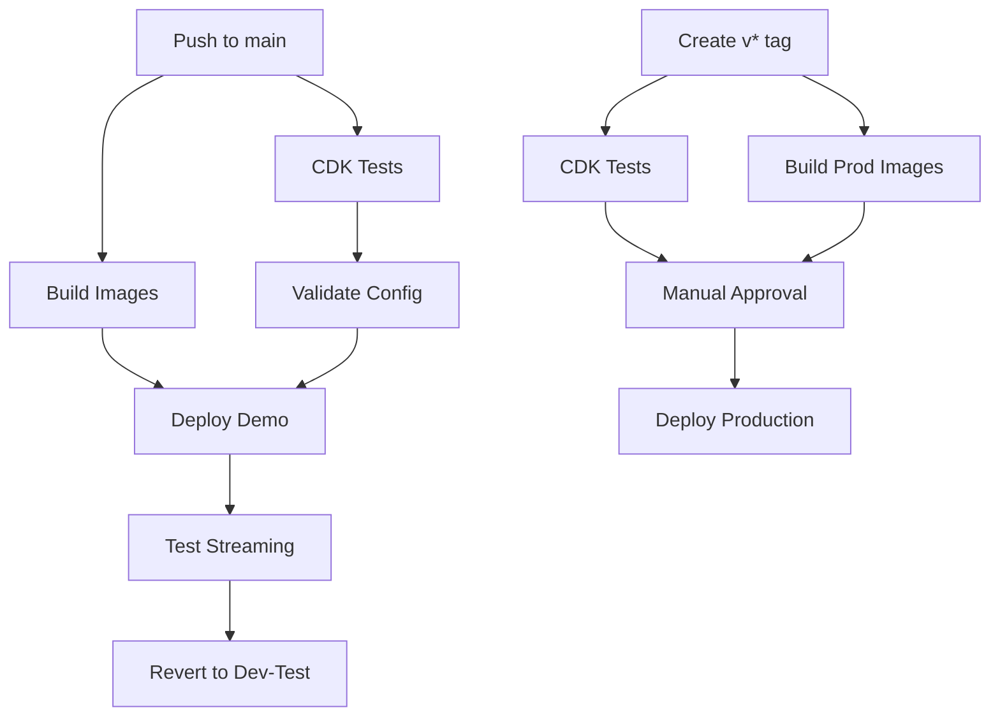

# AWS GitHub Actions Setup for MediaInfra

This guide covers setting up GitHub Actions for the MediaInfra repository, building on the base infrastructure already configured in BaseInfra.

## Prerequisites

**⚠️ Important:** Steps 1-2 from the [BaseInfra AWS GitHub Setup](https://github.com/TAK-NZ/base-infra/blob/main/docs/AWS_GITHUB_SETUP.md) must be completed first:
- Route 53 DNS setup
- GitHub OIDC Identity Provider and IAM roles

> **Note:** The organization variables and secrets configured in BaseInfra will be used for both environments.

**Required Infrastructure:** Ensure these stacks are deployed before MediaInfra:
- BaseInfra (VPC, ECS, KMS, ACM)
- AuthInfra (Authentication services)
- TakInfra (TAK Server)
- CloudTAK (API and media services)

## 3. GitHub Environment Setup for MediaInfra

### 3.1 Create Environments

In your MediaInfra GitHub repository, go to **Settings → Environments** and create:

1. **`production`** environment
   - **Protection rules:**
     - Required reviewers: Add team leads
     - Wait timer: 5 minutes
     - Deployment branches and tags: Select "Selected branches and tags"
       - Add rule: "v*" (for version tags like v1.0.0)

2. **`demo`** environment
   - **Protection rules:**
     - Deployment branches and tags: Select "Selected branches and tags"
       - Add rule: "main"

## 4. Branch Protection Setup

**Configure branch protection for `main`** to ensure only tested code is deployed:

1. Go to **Settings → Branches → Add rule**
2. **Branch name pattern**: `main`
3. **Enable these protections:**
   - ☑️ Require a pull request before merging
   - ☑️ Require status checks to pass before merging
     - ☑️ Require branches to be up to date before merging
     - ☑️ Status checks: Select "Test CDK code" after first workflow run

## 5. Breaking Change Detection for MediaInfra

### 5.1 MediaInfra-Specific Breaking Changes

**Critical resources that trigger breaking change detection:**
- Network Load Balancer replacements
- ECS service configuration changes
- Target group replacements
- Security group rule changes
- Route 53 record modifications
- ECR repository deletions

### 5.2 Implementation

MediaInfra uses the same breaking change detection system as other TAK layers:

1. **Stage 1 (PR Level)**: CDK diff analysis during pull requests - fast feedback
2. **Stage 2 (Deploy Level)**: CloudFormation change set validation before demo deployment - comprehensive validation

### 5.3 Override Mechanism

To deploy breaking changes intentionally:

1. **Include `[force-deploy]` in commit message**
2. **The workflows will detect the override and proceed with deployment**
3. **Use with caution** - ensure dependent services are updated accordingly

## 6. GitHub Actions Workflows

### 6.1 Workflow Architecture



### 6.2 Demo Testing Workflow (`demo-deploy.yml`)

**Triggers:**
- Push to `main` branch
- Manual dispatch

**Jobs:**
1. **test**: Run CDK unit tests and linting
2. **build-images**: Build MediaMTX Docker images
3. **validate-config**: Validate production configuration
4. **deploy-and-test**: Deploy with prod profile and run streaming tests
5. **revert-to-dev-test**: Always revert to dev-test configuration

### 6.3 Production Deployment Workflow (`production-deploy.yml`)

**Triggers:**
- Version tags (`v*`)
- Manual dispatch

**Jobs:**
1. **test**: Run CDK unit tests
2. **build-images**: Build production MediaMTX images
3. **deploy-production**: Deploy to production with built images (requires approval)

### 6.4 Image Building Process

**Build Process:**
1. Checkout repository code
2. Build MediaMTX Docker image with CloudTAK integration
3. Tag images with commit SHA and environment tags
4. Push images to ECR
5. Deploy using pre-built images for faster deployment

**Image Tags:**
- `{commit-sha}` - Specific commit build
- `dev-latest` - Latest development build
- `prod-latest` - Latest production build
- `v{version}` - Release version tags

## 7. Required Secrets and Variables

### 7.1 Organization Secrets (configured in BaseInfra)

| Secret | Description | Used For |
|--------|-------------|----------|
| `DEMO_AWS_ACCOUNT_ID` | Demo AWS account ID | Demo environment |
| `DEMO_AWS_ROLE_ARN` | Demo GitHub Actions IAM role ARN | Demo environment |
| `DEMO_AWS_REGION` | Demo AWS deployment region | Demo environment |
| `PROD_AWS_ACCOUNT_ID` | Production AWS account ID | Production environment |
| `PROD_AWS_ROLE_ARN` | Production GitHub Actions IAM role ARN | Production environment |
| `PROD_AWS_REGION` | Production AWS deployment region | Production environment |

### 7.2 Organization Variables (configured in BaseInfra)

| Variable | Description | Used For |
|----------|-------------|----------|
| `DEMO_STACK_NAME` | Stack name suffix for demo | Demo environment |
| `DEMO_TEST_DURATION` | Test wait time in seconds | Demo environment |
| `DEMO_R53_ZONE_NAME` | Demo Route53 zone name | Demo environment |

### 7.3 Repository Variables

| Variable | Description | Values | Usage |
|----------|-------------|--------|-------|
| `ECR_REPOSITORY` | ECR repository name for MediaMTX images | `tak-media-infra` | Image storage and deployment |
| `ENABLE_INSECURE_PORTS` | Enable RTMP/RTSP insecure ports for testing | `true`, `false` | Demo environment testing only |

## 8. Composite Actions

### 8.1 Setup CDK Environment Action

Location: `.github/actions/setup-cdk/action.yml`

**Purpose:** Reduces code duplication by consolidating common setup steps:
- Repository checkout
- Node.js setup with npm caching
- AWS credentials configuration
- Dependency installation

**Benefits:**
- Consistent setup across all workflows
- Easier maintenance and updates
- Reduced workflow file size
- Centralized Node.js and AWS configuration

## 9. Verification

Test the MediaInfra setup:

1. **Demo Testing:** Push to `main` branch → Should build images → Deploy demo → Test streaming → Revert
2. **Production:** Create and push version tag:
   ```
   git tag v1.0.0
   git push origin v1.0.0
   ```
   → Should require approval → Deploy after approval

### 9.1 Deployment Flow

**Main Branch Push:**
```
Push to main → Tests → Build Images → Demo (prod profile) → Stream Tests → Demo (dev-test profile)
```

**Version Tag Push:**
```
Tag v* → Tests → Build Images → Production (prod profile) [requires approval]
```

**Benefits:**
- Cost optimization: Demo runs dev-test profile between deployments
- Risk mitigation: Both profiles tested in demo before production
- Separation: Independent workflows for demo testing vs production deployment

## 10. Troubleshooting

### 10.1 Common Workflow Issues

| Issue | Symptoms | Solution |
|-------|----------|----------|
| **Missing Secrets** | `Error: Could not assume role` | Verify organization secrets are set correctly |
| **Missing Variables** | `Error: Required variable not set` | Ensure organization variables are configured |
| **Breaking Changes** | Workflow stops at validation | Use `[force-deploy]` in commit message or fix changes |
| **Image Build Fails** | Docker build errors | Check Dockerfile and MediaMTX dependencies |
| **CDK Synthesis Fails** | `cdk synth` command fails | Verify cdk.json context values |
| **Deployment Timeout** | Job runs for hours | Check AWS resources and add timeout settings |
| **Streaming Tests Fail** | Cannot connect to MediaMTX | Verify security groups and NLB configuration |

### 10.2 MediaInfra Specific Issues

**Common MediaInfra Problems:**

- **MediaMTX Container Issues:** Check container logs for MediaMTX startup errors
- **CloudTAK Integration:** Verify CloudTAK API secrets are accessible
- **Streaming Protocol Issues:** Check security group rules for streaming ports
- **Load Balancer Health:** Verify NLB target group health checks
- **ECR Image Issues:** Confirm images are built and tagged correctly
- **Authentication Failures:** Check CloudTAK API connectivity and secrets

**Troubleshooting Steps:**

1. Check MediaMTX version in Docker image
2. Verify stack status in CloudFormation console
3. Review ECS service logs for container issues
4. Test streaming endpoints manually
5. Confirm CloudTAK API integration
6. Check NLB target group health
7. Verify security group rules for streaming ports

### 10.3 Dependencies on Other TAK Layers

**Required BaseInfra Resources:**
- VPC and networking (subnets, security groups)
- ECS cluster for container deployment
- KMS keys for encryption
- Route 53 hosted zones for DNS
- ECR repositories for Docker images

**Required AuthInfra Resources:**
- Authentication services (not directly used but part of stack dependencies)

**Required TakInfra Resources:**
- TAK server (not directly used but part of stack dependencies)

**Required CloudTAK Resources:**
- CloudTAK API endpoints for authentication
- Signing secrets for stream authentication
- Media secrets for additional security

Ensure BaseInfra, AuthInfra, TakInfra, and CloudTAK are deployed and stable before deploying MediaInfra changes.